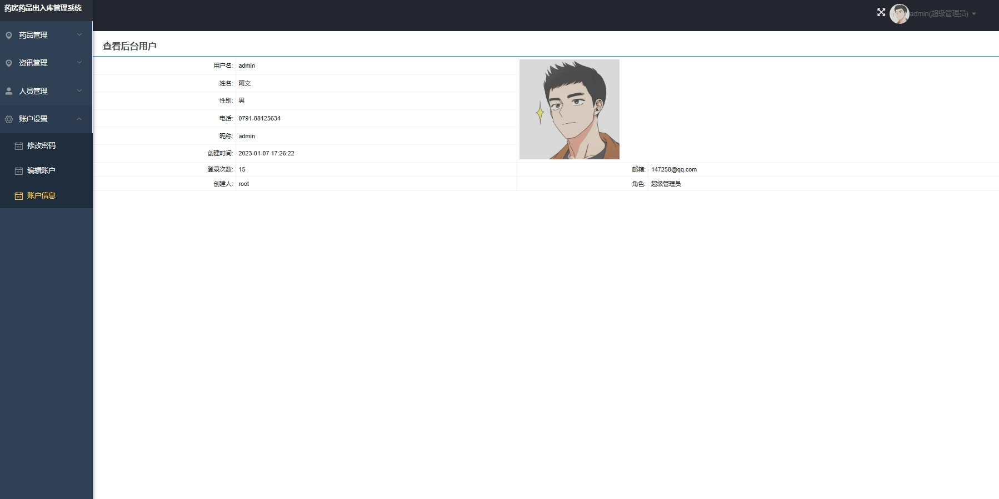
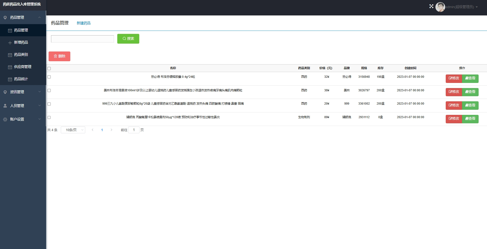
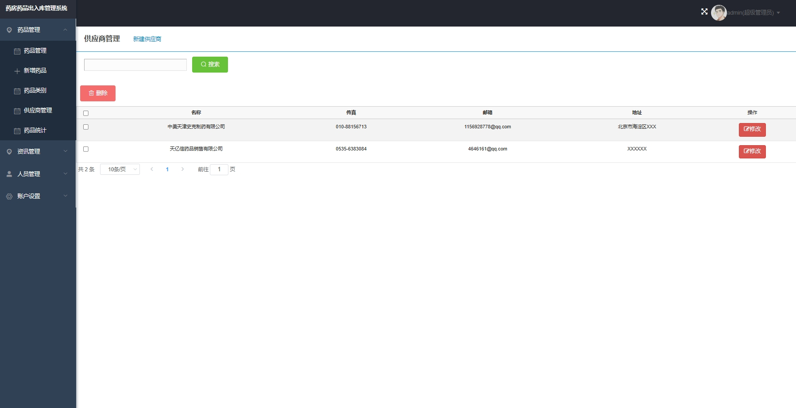
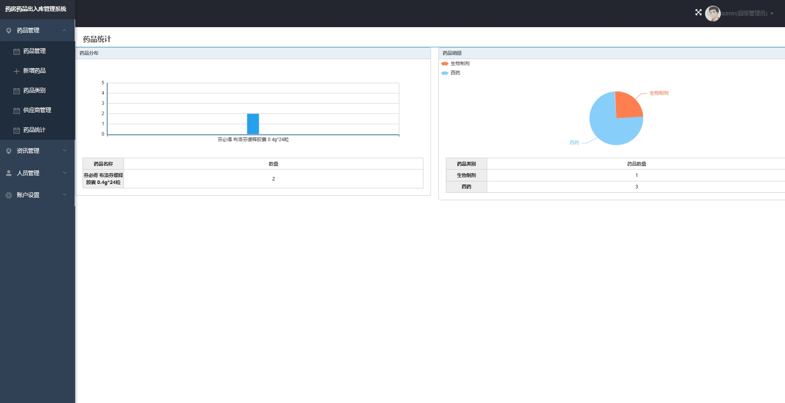
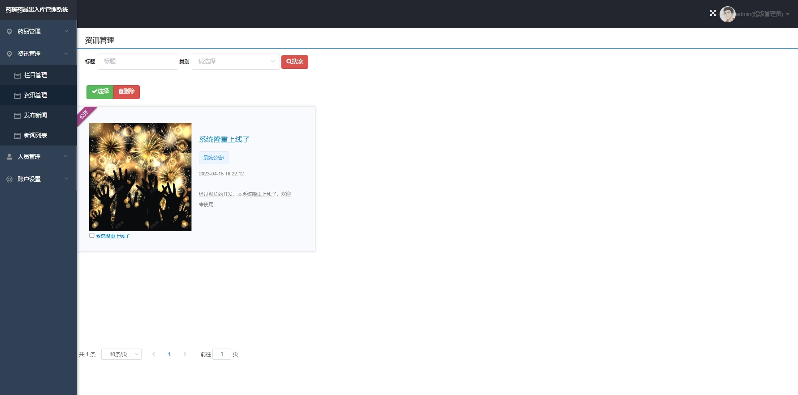

# 1.项目介绍
- 功能模块：药品管理、供应商管理、药品统计、用户管理、角色管理等
- 技术栈：SpringBoot，Druid，fastjson，MyBatis
- 测试环境： idea2024，MySQL5.7，Maven3，Navicat
# 2.项目部署
- 创建数据库，导入sql
- 根据本地数据库环境修改src/main/resources/application.properties 14-16行
- 启动项目 http://localhost:8080/invoicing  管理员账号密码：admin/admin
# 3.项目部分截图

# 4.获取方式
[戳我查看](https://gitee.com/aven999/mall)
